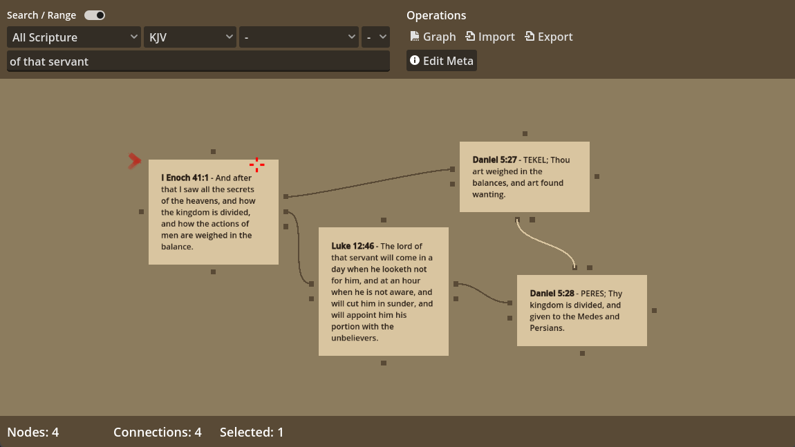

# Scrollmapper - Features 

## Scripture Mapping for Cross-Reference Generation

Scrollmapper is designed to help create cross-references to lost books such as [Enoch](https://github.com/scrollmapper/bible_databases_deuterocanonical/blob/master/sources/en/1-enoch/1-enoch.md), [Gad](https://github.com/scrollmapper/bible_databases_deuterocanonical/blob/master/sources/en/gad-the-seer/gad-the-seer.md), and [2 Esdras](https://github.com/scrollmapper/bible_databases_deuterocanonical/blob/master/sources/en/2-esdras/2-esdras.md).

To simplify this often tedious process, we use a graphing method to illustrate complex relationships between many books, whether canonical or extracanonical. These relationships can then be saved as basic cross-references to be shared among users, databases, or analyzed in [Gephi](https://gephi.org/).

## Book Importing, Reading, and Research

Scrollmapper imports books directly from the main Scrollmapper databases on GitHub:

- https://github.com/scrollmapper/bible_databases
- https://github.com/scrollmapper/bible_databases_deuterocanonical

Scrollmapper includes a basic reader so that you can read any of the biblical or lost books you wish. It also contains a well-established cross-referencing database from [openbible.info](https://www.openbible.info/labs/cross-references/), which allows for some pretty depthy connections research out of the box. 

> **Note** At the time of this writing, the app is still in prototype phase. Secondary features and presentation are a bit basic. 

## Meta Editing 

Meta data can be attached to individual verses. This can be applied on exports to Gephi to later isolate unique data that you previously set for node/edge network analysis. 