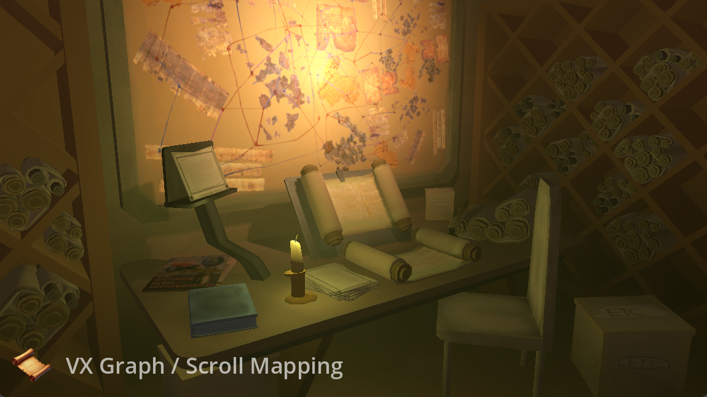
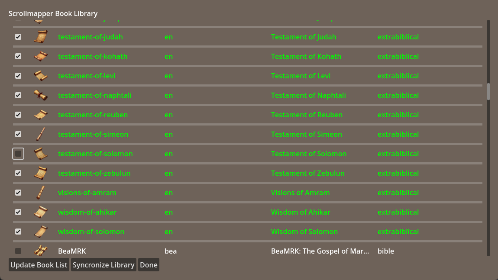
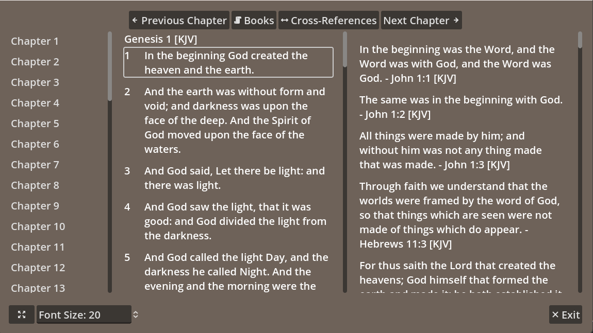

# Scrollmapper - Getting Started 

On the main intro screen, hover your mouse over the various elements in the picture. The light will shine on whatever you focus on. 

A little scroll with a label will show what feature it is.

Clicking on the item focused will bring up its work area. 

> **Note** The main features are working, but a few items may seem incomplete -- this is because they are prepared for features being added later. 

## VX Editor

"VX" is a cute way of saying Cross-verse. It is our cross-reference graphing and export system that we have created. 

Simply click on the main bulletin board to use the VX-System. 

The workflow is simple: Search verses, and add them to the graph. Move them around and connect them according to your wishes. 

Eventually you will produce a graph of connected scriptures that should relate to eachother. 

See VX-Graph tutorial here: <tutorial>

## Book Downloader 

The Book Downloader allows you to download various books directly into the Scrollmapper system. 

Generally, Scrollmapper comes with all of the extra-biblical books installed. But who knows -- you might not want the Testament of Solomon! In that case, just uncheck it and press "Syncronize Library", and it will be removed from the database. 

Books can installed and uninstalled one or many at a time. 

The **Update Book List** button will refresh the main book list from the Scrollmapper repository (https://github.com/scrollmapper/book_list). Occasionally, new books are added to the collection, and this will update your local book list. *(Note: Due to a small bug, you will need to exit this screen and return to see the update.)*

## Reader 

## Reader 

The reader allows you to read the books in-app. This is useful because there are quite a few extra-biblical books that you may wish to review. When reading the main canonical books, you will also be able to see cross-references to the scriptures by double-clicking verses in the reader.

If you save cross-references to the database from the VX-Editor, they should show up here as well. 

