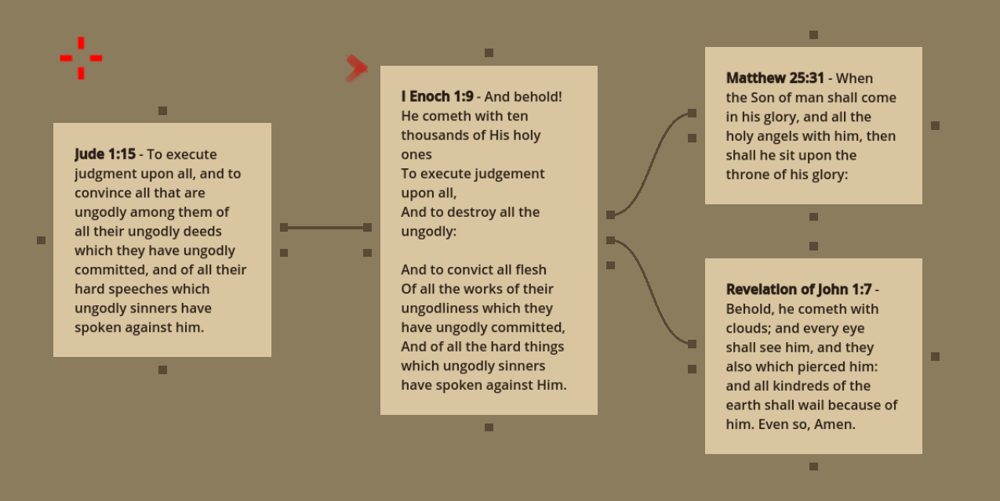
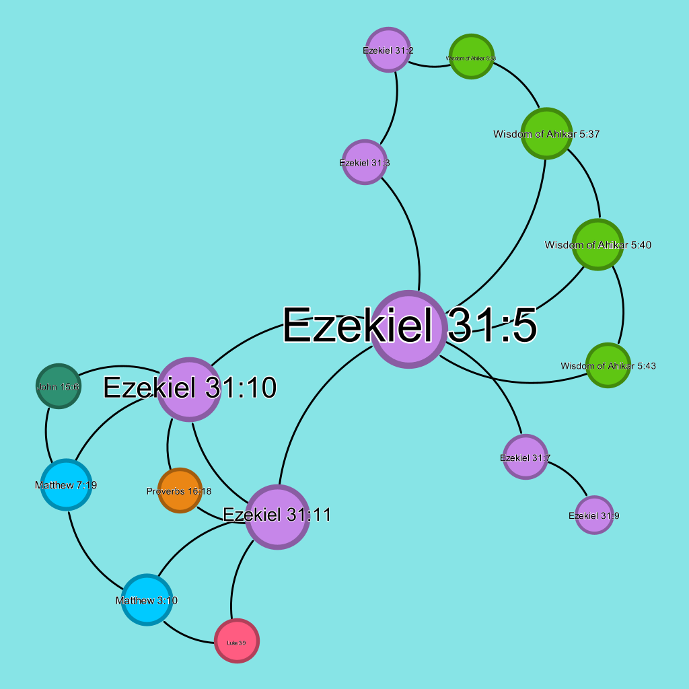

# Scrollmapper - Introduction

## Primary Use

**Scrollmapper** is a tool for creating detailed cross-references for canonical and apocryphal scriptures. It includes a basic reader and cross-reference viewing system.

Scripture graphs, or "Scroll Maps," can be exported to [Gephi](https://gephi.org/) (.gexf format), saved to a local database, or exported to CSV.

## Advanced Use: Gephi Integration

Scrollmapper can export thousands of cross-references to Gephi for deep analysis of scripture relationships. This feature helps visualize and explore connections between verses and books, providing valuable insights.

Scrollmapper comes pre-populated with 34,000 cross-references from [openbible.info](https://www.openbible.info/labs/cross-references/), allowing immediate exploration and analysis without additional data entry.

## Made in Godot

Scrollmapper is built using the game engine [Godot](https://godotengine.org/), which enables it to feature visually appealing graphical interactions.

We hope to include more features such as flash cards, slide shows, and more.