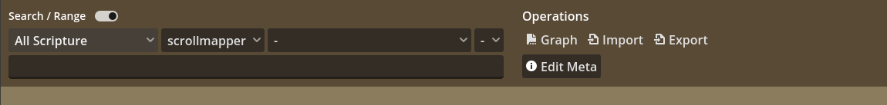
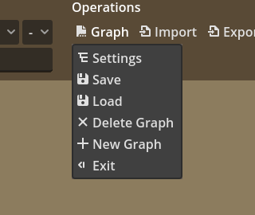
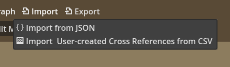
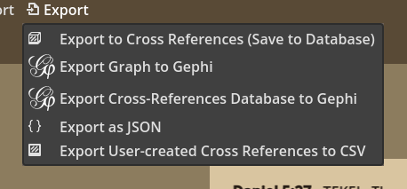
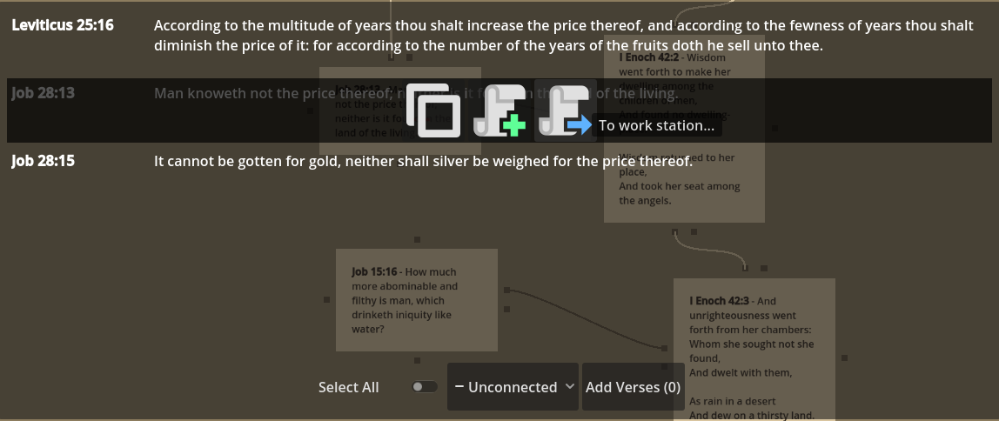
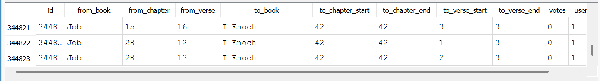

# Scrollmapper - Tutorial 1: Using the Node System

> **NOTE** This is the most important tutorial document in Scrollmapper. Read it carefully.

In the main graphing area, you will find a canvas where you can create connected nodes. You will also have various options for saving, exporting, and working with the nodes.

## Overview of Graph Options

List of graph control functions and operations:

- **Search Bar (left)** The main search mechanism for adding verses to the graph, either one-by-one or in mass amounts. Can search by word or range.
- **Controls Area (right)** Settings, saving, exporting, importing, and meta controls.

> **Note** You will mainly work with the search bar to bring new verse nodes into the VX Graph. (VX Graph is the name of our scripture mapping system, which stands for Cross-Verse).

### Graph Dropdown

- **Settings** This is the main info settings for the graph. At this time you may save its title and description.
- **Save** Saves the graph.
- **Load** Loads a graph.
- **Delete Graph** Deletes the currently open graph.
- **New Graph** Creates a new blank graph.
- **Exit** Brings you back to the home screen of the Scrollmapper app.

### Import Dropdown

- **Import from JSON** When a user exports a graph, it is exported as a JSON object. This can re-import a graph from JSON.
    - > **Note** If a user creates a graph using a book not currently in your library, then the nodes for that book will not import. Collaboration and communication between users and projects are necessary here.
- **Import User-created Cross References from CSV** If a user exports a list of cross-references they had created (in the export options), it can be re-imported here. These will be imported to the database (not to a graph).

### Export Dropdown

- **Export to Cross-References** Saves your graph to the cross-references database. This is technically an export operation, which is why it is named such.
- **Export Graph to Gephi** Will export the graph as a **[.gexf](https://gexf.net/)** file for use in **[Gephi](https://gephi.org/)**.
- **Export Cross-References Database to Gephi** This will export the ENTIRE cross-reference database to **[Gephi](https://gephi.org/)**. This will make an extremely large graph/dataset as Scrollmapper already contains 34,000 cross-references to start. Whatever you have exported to the cross-reference database will also be included.
- **Export as JSON** Will export the graph as a JSON object, which other users may import again. This is useful for collaboration.
- **Export User-Created Cross References to CSV** Will export chosen sets of cross-references to CSV format, which can be used in other apps or databases.

### Edit Meta
This is an advanced option for editing meta keys. These are used for isolating data later in **[Gephi](https://gephi.org/)**. 

## Working with Nodes

To explain the basics of the node system, here is a **network** we've created connecting two important wisdom books: Job and Enoch. 

> **Note** This simple graph shows the importance of this system in graphing relationships in the inspired word.

### Adding and Connecting Nodes

To add nodes, simply search them in the bar above, and use the add options to add them to the graph. 

In the above example, you see a verse about to be added.

- The blue arrow will add the verse as a node to the graph. 
- The green plus icon will add the verse for a multiple-selection operation, which will add multiple verses to the graph (This operation is completed by choosing the Add Verses button below). 
- You can save time by adding nodes in linear to the selected node, or in parallel to the selected node. 

### Linear and Parallel Connections

- **Linear Connections** flow top to bottom. They represent linear progression of text, such as shown in **Job 28:12-13** and **Enoch 42:1-3** in this graph.
- **Parallel Connections** flow left to right. They are connections between scriptures, classically known as cross-references. In the graph, you see these parallel relationships:
  - **Job 28:12** connects to **Enoch 42:1**
  - **Job 28:13** connects to **Enoch 42:2**
  - **Job 15:16** connects to **Enoch 42:3**

> **NOTE** It is very important to recognize how node-flow works, as it affects how data is exported in some cases. 

**Remember:**
- Linear connections flow top to bottom. 
- Parallel connections flow left to right. 

**Remember:**
- Linear connections (top to bottom) represent the progression of text, such as reading an account linearly.
- Parallel connections (left to right) represent parallel thoughts or connected accounts, especially symbolically.

### When Designing for Cross-References

When / if you are designing a graph that will save its relationships as cross-references, you must keep in mind some important points. 

Look at how this graph exports to the database:

Notice how there is a ONE-to-ONE or ONE-to-MANY relationship between scripture connections. Specifically, *one verse* can connect to another verse, or a passage of verses. 

> **NOTE** This was decided based on how [openbible.info](https://www.openbible.info/labs/cross-references/) prepared their data. It is also more portable to stick to this convention. 

In the Scrollmapper format, a CSV can be exported that takes this format: 

| from_book | from_chapter | from_verse | to_book | to_chapter_start | to_chapter_end | to_verse_start | to_verse_end | votes | user_added |
|-----------|--------------|------------|---------|------------------|----------------|----------------|--------------|-------|------------|
| Job       | 15           | 16         | I Enoch | 42               | 42             | 3              | 3            | 0     | 1          |
| Job       | 28           | 12         | I Enoch | 42               | 42             | 1              | 3            | 0     | 1          |
| Job       | 28           | 13         | I Enoch | 42               | 42             | 2              | 3            | 0     | 1          |

This can, in turn, be used in Google Docs, Excel, etc. 

In the **OpenBible** format:

| From Verse | To Verse                  | Votes |
|------------|---------------------------|-------|
| Job.15.16  | I Enoch.42.3              | 0     |
| Job.28.12  | I Enoch.42.1-I Enoch.42.3 | 0     |
| Job.28.13  | I Enoch.42.2-I Enoch.42.3 | 0     |

Here you can clearly see one-to-one and one-to-many relationships in both exported **.csv** files. 

Simply stated, in this graph, one verse in Job was connected to another verse in Enoch. A second verse in Job was connected to a passage in Enoch, same area. 

> **NOTE** As Scrollmapper continues to grow in its use with other applications, these rules will become more important. 

## Now that you know the basics...

You are able to use Scrollmapper's basic graphing techniques. 

Scrollmapper was created to allow users to create cross-reference databases for the lost books, such as Enoch used in this example. 