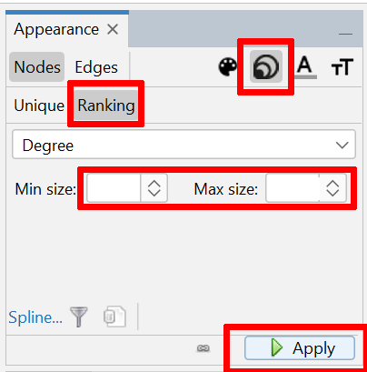

# Scrollmapper - Tutorial 2: Using Scrollmapper with Gephi

Integrating Scrollmapper with [Gephi](https://gephi.org/) opens up powerful possibilities for analyzing biblical texts. Scrollmapper includes 340,000 cross-references from [openbible.info](https://www.openbible.info/labs/cross-references/), providing a rich dataset for big-data analysis.

## Gephi Integration

With Scrollmapper's extensive dataset, you can leverage Gephi's advanced graph analysis tools to uncover intricate relationships within the scriptures.

For those familiar with Gephi, the potential is vast. You can visualize and analyze the connections between different parts of the Bible, identify central themes, and explore the structure of biblical narratives. Gephi's capabilities allow for in-depth exploration of canonical scriptures, revealing patterns and insights that might not be immediately apparent through traditional study methods.

## Scrollmapper -> Gephi Basics

Scrollmapper exports to Gephi using the **[.gexf](https://gexf.net/)** format. Opening the .gexf file will reveal an entire network of connected verses ready for Gephi editing and analysis.

Using the simple example from [Tutorial 1](tutorial_1.md), let us export a basic graph to Gephi.

Here it is in Scrollmapper:

By choosing `Export -> Export Graph to Gephi`, and importing it into Gephi, you get this:

This small graph provides you with quite a bit of information:

Here are the default attributes that are available for every node in Gephi:

- Id
- Label
- scripture_text
- scripture_location
- translation
- book
- chapter
- verse

If you export from Scrollmapper with custom attributes (using Scrollmapper's verse meta feature), you can have even more attributes to filter/work with in Gephi.

For example, by having the verse text available, you can search all nodes according to the text the scriptures contain:

This might not seem like much, but with a dataset of thousands of connected verses, Gephi becomes very useful for analyzing data.

Here is a quick-generated graph of the *minor prophets* and their relationships to each other:

> **NOTE** Organizing and isolating node groups is a huge focus in Gephi. However in this case, we've run some auto-layouts for a quick result. 

And the corresponding data laboratory:

You can see that Gephi editing and analysis adds many new metrics to study the data on. This is a specialized subject that can go as deep as you want it to.

So let's give a small tutorial on how to productively analyze scripture data exported from Scrollmapper.

## A Basic Scrollmapper to Gephi Project 

Let's not start small. To quote Tony Stark from Iron Man:

> "Sometimes you gotta run before you can walk."

To get a sense of working with data in Gephi, let us first export ALL of the default cross-references logged in Scrollmapper.

We will be performing these steps:

- Export cross-references as a graph / network from Scrollmapper.
- Import the cross-references graph into Gephi.
- Clean up the graph for easy viewing and analysis. 

### Export Cross References from Scrollmapper 

To export the cross-references, simply choose the `Export Cross References Database to Gephi` option under `Export`. 

Save it to your desktop, or wherever you wish. You will notice some options for Meta items to attach. Ignore this for now.

The default filename will be `cross-references-graph.gexf`. You may change it if you wish. 

Depending on your computer, this could take a few minutes. It is taking 340,000 cross-refernces and building a `.gexf` `xml` document from them. 

### Import Cross References to Gephi 

If you have already [installed Gephi](https://gephi.org/), simply double-clicking the exported file should open it in Gephi. If not, then open Gephi and **Open**  the `.gexf` file you created.

> **NOTE** Importing it is not the method here. **Open** is the valid workflow here. 

Now you should see something like this: 

The numbers may be different if you've already saved some of your own Scrollmapper node networks to the cross-reference database. 

Push **Ok** and the graph should populate. 

What you are now seeing is a square of densely packed nodes and connections, or as they are called in Gephi, **nodes** and **edges**.

Let's take a moment to see the data laboratory -- the table of nodes and connections...

Push the **"Data Laboratory"** button, which is beside the **"Overview"** button. It is under **File**, **Workspace**, etc...

This is the starting tables that were imported from the `.gexf` file Scrollmapper generated. 

Notice there is a **Nodes** and **Edges** table. As you work with the data, you will be using these tables a lot. 

Now go back to the **Overview** tab so we can make the graph more visually sensible and easy to work with. 

Because of the huge amount of data, we need to distribute the nodes in a way that is efficient. A good layout option in this case is the "OpenOrd" layout. Choose "OpenOrd" from the Layout dropdown menu. 

> **NOTE** See [Why do we choose OpenOrd layout?](#why-do-we-choose-openord-layout)

The default values for this OpenOrd layout are fine. But set the **Edge Cut** value to 0. We do not want to lose any cross-references (edges).

> **NOTE** It may seem odd seeing a few node groups floating separate from the network when you run it. That is because some cross-references are isolated. 

**Run the layout algorithm** and let it go through the process. It may take a few minutes. 

It will gradually distribute the nodes. You should end up with something like this:

Click the black "T" button below the graph (bottom toolbar) and you should see the Verse labels: 

At first the labels may seem too large, and running into each-other. Use the sliders in the bottom toolbar to change the label size. It should appear somewhat like the preview above. 

Now the fun part! We are going to make the graph more readable, colorful, and visually useful. 

For now, turn off the labels. We only wish to see the nodes at this time. 

Here is what we will do:

- Set node colors based on the book they belong to. (This is recognized as a "partition" in Gephi)
- Then we will set the node size based on degree (or relevance). This is judged by how many connects / edges a given node has. 
- Lastly we will run a layout algorithm to reduce node overlapping and deal with clutter. 

#### Set Node Colors by Book

`Appearance -> Nodes -> Partition` and choose `Book` for the attribute. 

If you scroll down, you will notice that the colors desaturate to gray. We do not want this, but rather all the books should have unique colors. 

Choose `Palette` at the bottom of the `Appearance` panel. 

At the **top right** of this dialog, make sure `Limit number of colors` is unchecked. 

You will want to select `Generate` at the bottom. `Default` color scheme / preset is sufficient for this case. 

Next, push `Ok` and the new book colors will generate. Verify them if you wish. 

Lastly, push `Apply` at the bottom of the **Appearance** panel. 

Turn off the labels if you haven't already. 

In the toolbar left of the graph window, you can see a little magnifying glass. Click that. It will recenter the graph. 

The graph should now look something like this:

> **NOTE** I zoomed in using the mouse-wheel for this capture...it was zoomed out much more initially, due to outlying nodes. 

#### Set Node Size Based on Degree

Now choose `Appearance -> Nodes -> Ranking` and select `Degree` from the Attributes dropdown. 

It seems that the 10 for min, and 100 for max provide for a decent node size range in this case. You may experiment and change the values how you wish. 

Here is how it should look now...

#### Minimize Overlapping / Reduce Clutter 

This next operation may take a bit of time to process due to the large number of nodes. 

In the `Layout` panel, select `Expansion` in the dropdown. 

Set the Scale Factor to 2 and run that a few times. (I ran it 3 times.)

**Save** the graph. 

This next step (**Noverlap**) is optional, because it can take a long time. 

In the `Layout` panel, select `Noverlap` in the dropdown. 

Press `Run` and let it process. 

This will take a long time. Especially on a slow computer. (You can use the `Expansion` algorithm a few times before this, and it may help the time a bit.)

### Why do we choose OpenOrd layout?

- **Scalability**: It is designed to handle large-scale graphs, making it suitable for big data visualization.
- **Cluster Detection**: OpenOrd emphasizes clustering by adjusting the position of nodes to reveal community structures within the graph.
- **Parallel Processing**: The algorithm can run in parallel, utilizing multiple cores to speed up the computation and enhance performance.
- **Phases**: OpenOrd operates in five distinct phases (liquid, expansion, cool-down, crunch, and simmer), each fine-tuning parameters like temperature and attraction to achieve an optimized layout.
- **Edge Cutting**: It uses edge cutting to promote clustering. This can be adjusted to either preserve or reduce edges, aiding in the visualization of densely connected groups.
- **Versatility**: OpenOrd's flexibility allows for both preserving all edges (setting edge cutting to 0) and aggressive clustering (increasing edge cutting).
